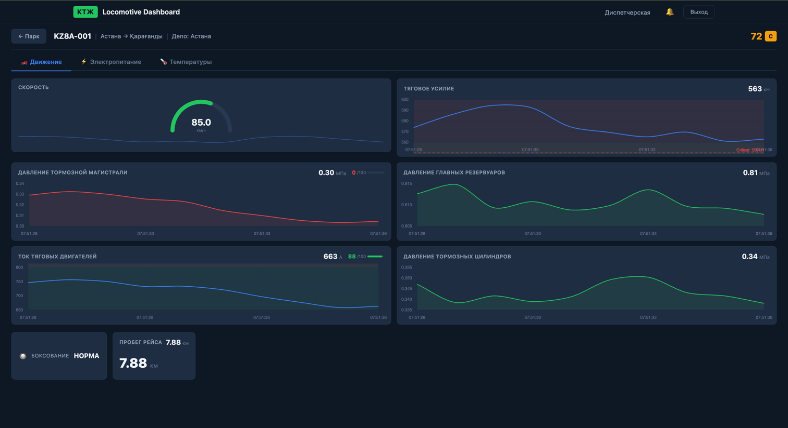

# КТЖ Locomotive Dashboard

Fullstack прототип дашборда мониторинга парка локомотивов в реальном времени для АО «Қазақстан Темір Жолы».
Отслеживает 10 локомотивов (6× ТЭ33А тепловозы + 4× KZ8A электровозы) с телеметрией, алертами и индексом здоровья.
Разработан для хакатона КТЖ.


---

## Требования

| Компонент | Версия |
|---|---|
| .NET SDK | 7.0 |
| Node.js | 18+ |
| Docker | опционально |

---

## Запуск

### 1) Напрямую через dotnet (dev)
```bash
cd KTZH
dotnet run
```
Backend + SPA проксируются автоматически → http://localhost:5000

### 2) Раздельно (frontend hot-reload)
```bash
# terminal 1 — backend
cd KTZH && dotnet run

# terminal 2 — Angular dev server
cd KTZH/ClientApp && npm install && npm start
```

### 3) Docker
```bash
docker-compose up --build
```
Открыть http://localhost:5000. SQLite персистится в `./data/ktz.db`.

**Логин**: `dispatcher` / `Ktz2026!`

---

## Архитектура

Монолит: ASP.NET Core API + SignalR Hub + EF Core (SQLite) + Angular SPA, обслуживаемая из `wwwroot`. Фоновый сервис `TelemetrySimulatorService` генерирует физически правдоподобную телеметрию каждую секунду, пушит её во фронтенд через SignalR, каждые 5 секунд пишет историю в SQLite. `HealthScoreEngine` рассчитывает прозрачный индекс здоровья 0–100 с расшифровкой по каждому параметру.

**Стек**:
- Backend: .NET 7, ASP.NET Core, SignalR, EF Core + SQLite, Swashbuckle (OpenAPI), Serilog, JWT Auth
- Frontend: Angular 15, TypeScript, Chart.js, Leaflet, @microsoft/signalr
- Инфра: Docker multi-stage build, docker-compose

---

## Health Score — алгоритм

Шкала 0–100 + грейд A/B/C/D/E (A = отлично, E = критическое). Каждый компонент нормируется линейно между Warning и Critical порогами (0–100).

**ТЭ33А (тепловоз)**
```
score = T_масла × 0.20 + T_ОЖ × 0.15 + P_масла × 0.20 +
        P_торм × 0.10 + топливо × 0.15 + обороты × 0.10 +
        ошибки × 0.10
```

**KZ8A (электровоз)**
```
score = U_КС × 0.25 + T_тр-ра × 0.20 + T_ТЭД × 0.15 +
        P_торм × 0.15 + I_ТЭД × 0.15 + ошибки × 0.10
```

| Score | Grade | Смысл |
|---|---|---|
| 90–100 | A | Отличное состояние |
| 75–89 | B | Хорошее, плановое ТО |
| 60–74 | C | Требует внимания |
| 40–59 | D | Повышенный риск |
| 0–39 | E | Критическое, немедленная остановка |

---

## REST API

Swagger UI: http://localhost:5000/swagger

| Method | Endpoint | Описание |
|---|---|---|
| GET | `/api/locomotives` | Список всех 10 локомотивов |
| GET | `/api/locomotives/{id}` | Детали + последняя телеметрия |
| GET | `/api/locomotives/{id}/history?hours=24` | История телеметрии |
| GET | `/api/locomotives/{id}/health` | Health Score с расшифровкой |
| GET | `/api/alerts?active=true` | Активные алерты |
| GET | `/api/health` | Healthcheck сервиса |
| POST | `/api/auth/login` | JWT вход |
| POST | `/api/debug/burst` | Highload тест x10 (только Development) |

**SignalR Hub**: `/hubs/telemetry`
- `ReceiveTelemetry` — снимок 1 локомотива (1×/сек)
- `ReceiveFleet` — состояние парка (5×/сек)
- `ReceiveAlert` — алерт при пересечении порога
- Группы: `fleet` (все), `loco-{id}` (конкретный)
